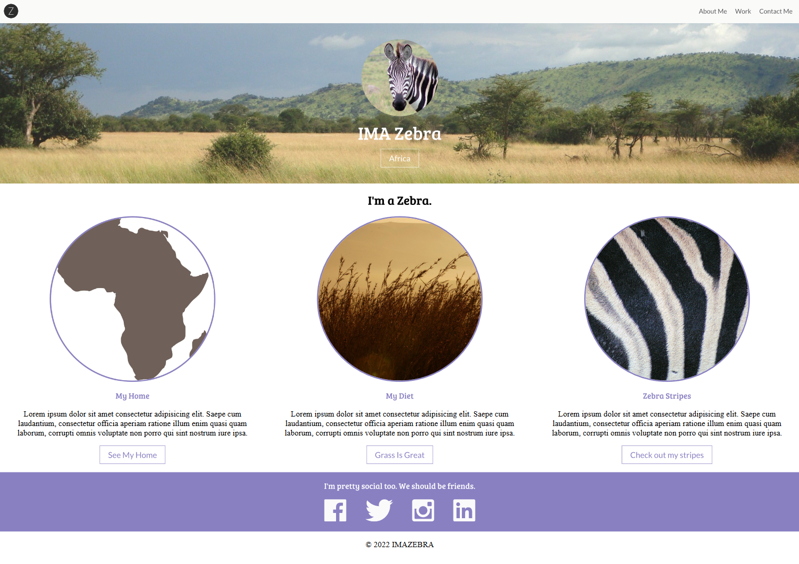

# Flexbox Challenge

Using this repo as a starting point, create the webpage shown below.

All assets needed are in the `images` directory, and the required fonts are already imported into `style.css`.

Good luck!

